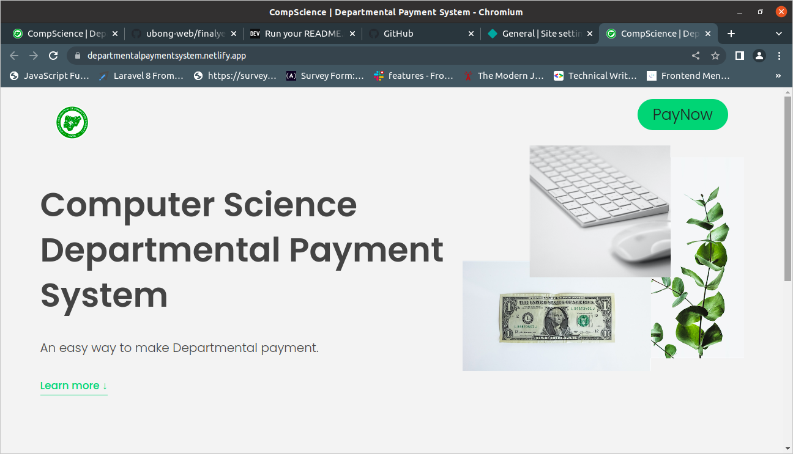

# Computer Science Departmental Payment System

This is the software that was built for my final project from the department of Computer science TASUED 2020 set.

## Table of contents

- [Overview](#overview)
  - [Screenshot](#screenshot)
  - [Links](#links)
- [My process](#my-process)
  - [Built with](#built-with)
  - [What I learned](#what-i-learned)
  - [Continued development](#continued-development)
  - [Useful resources](#useful-resources)
- [Author](#author)
- [Acknowledgments](#acknowledgments)

### Screenshot

### Links

- Solution URL: [Add solution URL here](https://github.com/ubong-web/finalyearproject)
- Live Site URL: [Add live site URL here](https://departmentalpaymentsystem.netlify.app)

## My process

The project was built using HTML, CSS and JAVASCRIPT. I made use of paystack Api to integrate payment gate way to enable students to be able to make payment online.

### Built with

- Semantic HTML5 markup
- CSS custom properties
- Javascript
- Paystack Api
